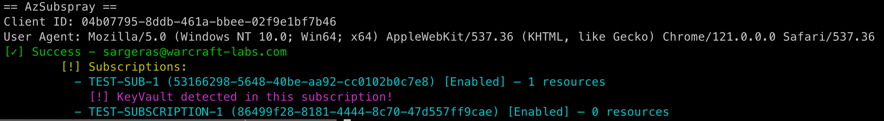

# AzSubSpray

Script to rapidly enumerate available Azure subscriptions provided a list of valid credentials.
Use cases include:
- Post-exploitation after password spraying
- Pivot to Azure after on-prem compromise

The tool supports custom client ID and User-Agent headers for CAP bypasses.


## Install

Easiest using pipx:
```
pipx install git+https://github.com/jakeotte/azsubspray
```

While you are free to increase the number of threads, please keep in mind that **this may cause rate limit errors!**

```
== AzSubSpray ==
usage: azsubspray.py [-h] [--client-id CLIENT_ID] [--user-agent USER_AGENT] [--threads THREADS] [--verbose] userpassfile

Spray Azure accounts to list subscriptions via ROPC.

positional arguments:
  userpassfile          File with username:password per line

options:
  -h, --help            show this help message and exit
  --client-id CLIENT_ID
                        Override the Azure AD client ID
  --user-agent USER_AGENT
                        Custom User-Agent for subscription request
  --threads THREADS     Number of threads to use. Default is 10.
  --verbose             Verbose output
```
